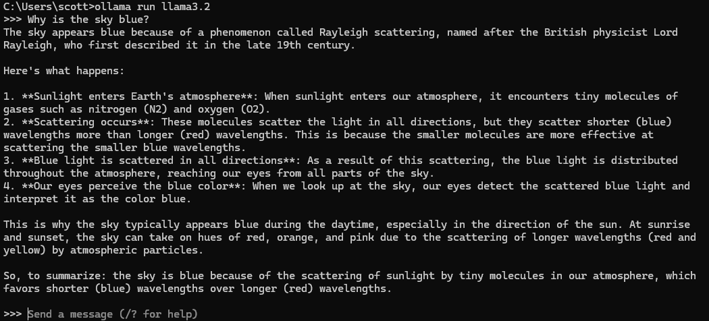
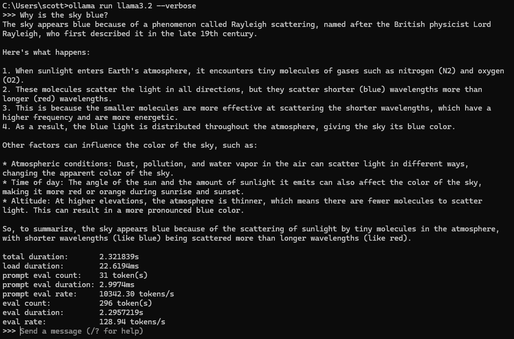

## Table of Contents

- [What is Ollama?](#what-is-ollama)
- [Installation](#installation)
- [Example](#example)
- [Conclusion](#conclusion)
- [Other Details](#other-details)

## What is Ollama?

Ollama is a powerful tool that allows you to run open-source large language models, such as Llama 3, Gemma, and others, directly on your own computer. This provides several benefits, including:

- **Privacy:** Your data remains on your local machine, ensuring privacy and security.
- **Cost-Effectiveness:** You can experiment with and use powerful AI models without incurring high API costs.
- **Offline Access:** Once a model is downloaded, you can use it without an internet connection.

### Installation

1.  **Download and Install Ollama:** Visit the [Ollama website](https://ollama.com/download) and download the application for your operating system (macOS, Linux, or Windows).

2.  **Verify Installation:** Open your terminal or command prompt and run the following command to ensure Ollama is running:

    ```bash
    ollama --version
    ```

3.  **Pull a Model:** To start using a model, you need to pull it from the Ollama library. For example, to download the Llama 3 model, run:

    ```bash
    ollama pull llama3.2
    ```

4.  **Run a Model:** Once the model is downloaded, you can run it directly from the command line which will launch a very simple chat interface:
    ```bash
    ollama run llama3.2
    ```

#### Example



### Conclusion

That's it! Once you have your Ollama server running and a model downloaded, you're ready to move onto the next step.

### Other Details

Additionally you can add `--verbose` to the end of the run command to see details on how well the model performs:

